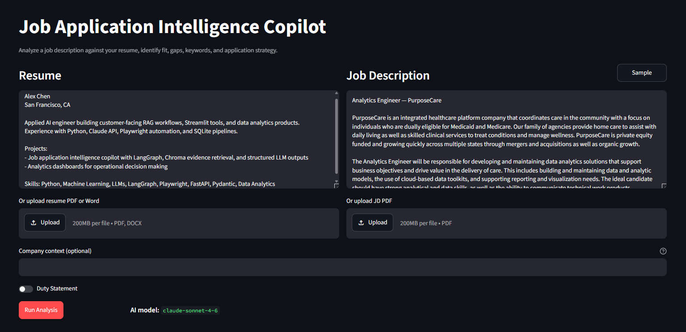
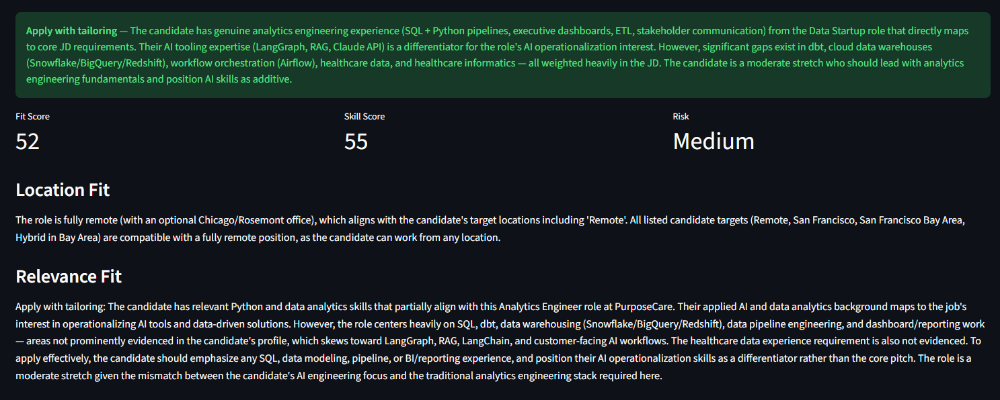
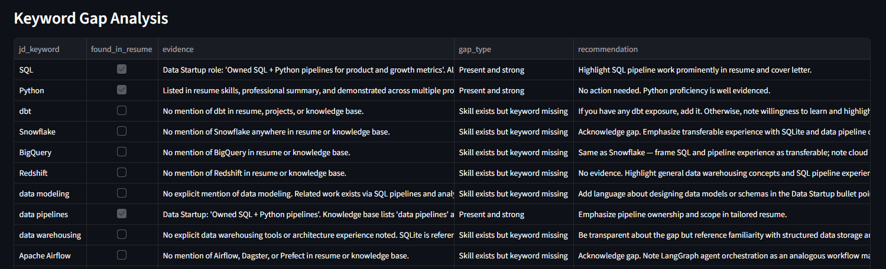
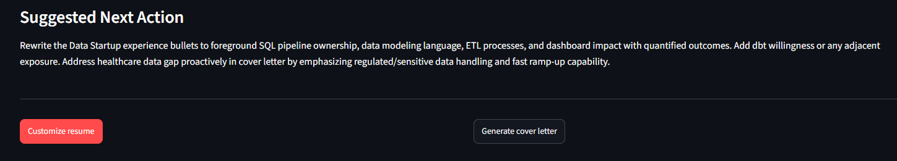
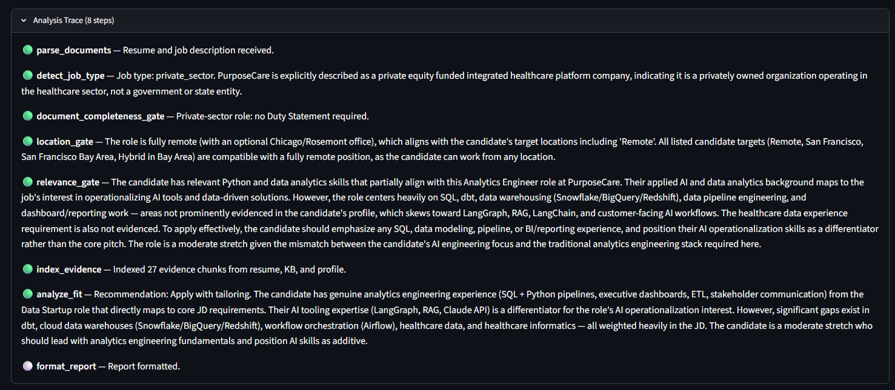
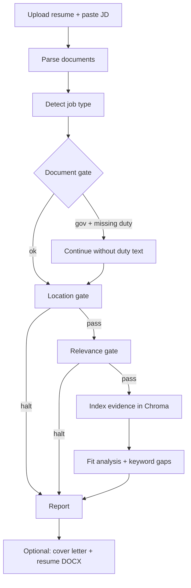

# Job Application Intelligence Copilot

**Pre-apply decision support for job seekers** — analyze a job description against your resume *before* you spend time applying. A gated LangGraph workflow checks location and role fit, surfaces keyword gaps with evidence from your materials, and optionally generates tailored application documents.

Built with **Streamlit**, **LangGraph**, **Anthropic Claude**, **Pydantic v2**, and **Chroma** (session-scoped retrieval).

## Screenshots

| Main workflow | Analysis report |
|---------------|-----------------|
|  |  |

| Keyword gaps | Application materials |
|--------------|----------------------|
|  |  |

| Analysis trace (LangGraph pipeline) | Eight gated steps |
|-------------------------------------|-------------------|
|  | parse → job type → document gate → location → relevance → evidence → fit → report |

Capture guide: [`screenshots/README.md`](screenshots/README.md). Use sample profile/KB only (no real career data in images).

---

## Why this exists

Most application tools optimize for speed. This copilot optimizes for **judgment**:

- **Stop early** when a role fails location or relevance gates
- **Ground every claim** in resume + knowledge-base evidence (no invented experience)
- **Show gaps honestly** — keywords missing from the resume but supported elsewhere
- **Generate materials on demand** — cover letter and a formatted, job-specific resume DOCX

The pipeline **fails loud**: missing inputs, parse errors, or ambiguous location data halt with a clear message instead of silently guessing.

---

## Features

| Capability | Details |
|------------|---------|
| **Gated workflow** | Document completeness → location → relevance → analysis |
| **Job-type awareness** | Detects gov/CA roles and prompts for Duty Statement when relevant |
| **Evidence retrieval** | Chroma indexes resume + KB chunks per session for gap analysis |
| **Fit report** | Recommendation, keyword gaps, objections, tailoring notes |
| **Cover letter** | LLM-generated from evidence only; sign-off uses candidate first name |
| **Custom resume DOCX** | 1100+ word minimum, Arial formatting, clickable header links from profile |
| **Resume cache** | Last uploaded resume restored on next launch |
| **Structured I/O** | Pydantic schemas for LLM JSON outputs and validation |

---

## Pipeline



**Inputs:** resume (PDF/DOCX/TXT), job description, `data/profile.json`, `Knowledge_Base_Source.txt` (local, gitignored — examples provided).

---

## Quick start

### Prerequisites

- **Python 3.12+**
- **Anthropic API key** ([console.anthropic.com](https://console.anthropic.com/))
- Windows optional: double-click launcher (see below)

### 1. Clone and install

```powershell
git clone https://github.com/Sam-M345/job-application-copilot.git
cd job-application-copilot

python -m venv .venv
.venv\Scripts\Activate.ps1   # macOS/Linux: source .venv/bin/activate
pip install -r copilot/requirements.txt
```

### 2. Add your data (local only — never committed)

```powershell
copy DOCS\copilot\profile.example.json data\profile.json
copy DOCS\copilot\Knowledge_Base.example.txt Knowledge_Base_Source.txt
```

Edit `data/profile.json` with your target locations, role themes, and links. Replace the knowledge base with your own Q&A and project notes (see example format).

### 3. Configure API access

Create `.env` in the repo root:

```env
ANTHROPIC_API_KEY=your_key_here
ANTHROPIC_MODEL=claude-sonnet-4-6
```

See [`copilot/.env.example`](copilot/.env.example) for optional LangSmith tracing.

### 4. Run

**Windows:** double-click [`Job Copilot.vbs`](Job%20Copilot.vbs) — creates venv, installs deps, opens `http://localhost:8501`.

**Any OS:**

```powershell
streamlit run copilot/app.py
```

Developer notes and architecture: [`copilot/README.md`](copilot/README.md)

---

## Usage

1. Upload your resume (or use the cached one from a prior session).
2. Paste a job description — or load a sample from the sidebar.
3. Click **Run analysis** and review gates, score, gaps, and recommendations.
4. If worth pursuing: **Customize resume** and/or **Generate cover letter**, then download DOCX.

**Sample fixtures** for manual smoke testing: [`DOCS/copilot/samples/`](DOCS/copilot/samples/) and [`DOCS/copilot/expected_outcomes.md`](DOCS/copilot/expected_outcomes.md).

---

## Tech stack

| Layer | Choice |
|-------|--------|
| UI | Streamlit |
| Orchestration | LangGraph (`StateGraph`, conditional gates) |
| LLM | Anthropic Claude (`claude-sonnet-4-6`) |
| Schemas | Pydantic v2 |
| Evidence store | Chroma (in-memory, per session) |
| Document I/O | pypdf, python-docx |
| Tests | pytest |

---

## Project structure

```text
├── copilot/
│   ├── app.py              # Streamlit UI
│   ├── src/
│   │   ├── graph.py        # LangGraph definition
│   │   ├── nodes.py        # Gate + analysis steps
│   │   ├── evidence.py     # Chroma indexing
│   │   ├── materials.py    # Cover letter + resume generation
│   │   └── resume_docx.py  # DOCX builder + formatting
│   └── tests/              # Unit tests (gates, parsers, DOCX, schemas)
├── DOCS/copilot/
│   ├── profile.example.json
│   ├── Knowledge_Base.example.txt
│   ├── samples/            # Sample JDs + resume text
│   └── expected_outcomes.md
├── Job Copilot.vbs         # Windows one-click launcher
└── data/.gitkeep           # Your profile.json lives here (gitignored)
```

---

## Tests

```powershell
python -m pytest copilot/tests -q
```

Covers location/relevance gates, PDF/DOCX parsing, resume cache, DOCX word count and hyperlinks, and Pydantic schema validation.

---

## Design principles

| Principle | Implementation |
|-----------|----------------|
| **No invented credentials** | Prompts and gates require evidence from resume/KB/profile |
| **Fail fast** | Unparseable PDF, missing profile fields, or unknown location → halt with message |
| **Gates before LLM spend** | Location and relevance checked before Chroma indexing and fit analysis |
| **Full report on “do not apply”** | You still see why — useful for learning and future roles |
| **Local-first privacy** | Real profile, KB, resumes, and API keys stay on your machine (`.gitignore`) |

---

## What’s not in this repo

The public tree is the Copilot only. These stay **local** (see [`.gitignore`](.gitignore)):

- `data/profile.json`, `Knowledge_Base_Source.txt`, uploaded resumes
- Logs, outputs, and `.env`
- Browser automation / userscript tooling (separate local workflow)

---

## Limitations (MVP)

- No job-board scraping or auto-apply
- No persistent vector DB across sessions
- Streamlit Cloud demo mode not yet shipped
- Cover letter prompt is simplified vs a full production library

**Roadmap:** hosted demo with sample profile + JD, optional job-board handoff link.

---

## License

Add your license before publishing (e.g. MIT). Until then, all rights reserved by the repository owner.

---

## Contributing

Issues and PRs welcome for Copilot improvements, sample fixtures, and docs. Please do not commit real profile data, knowledge bases, or API keys.
